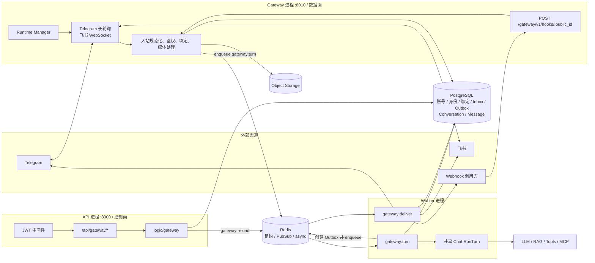
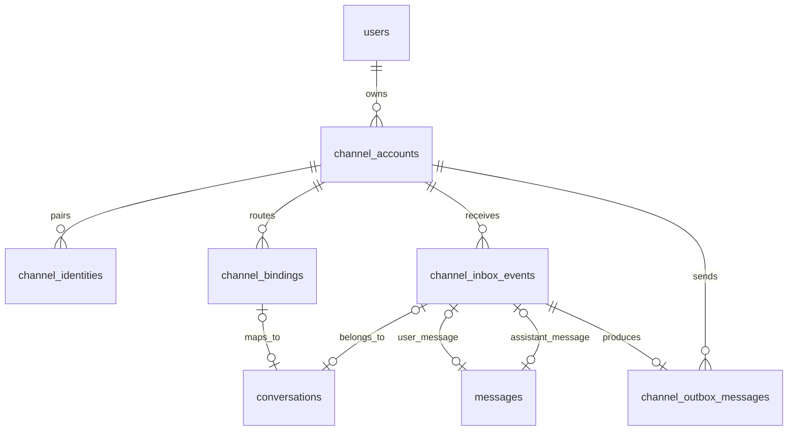
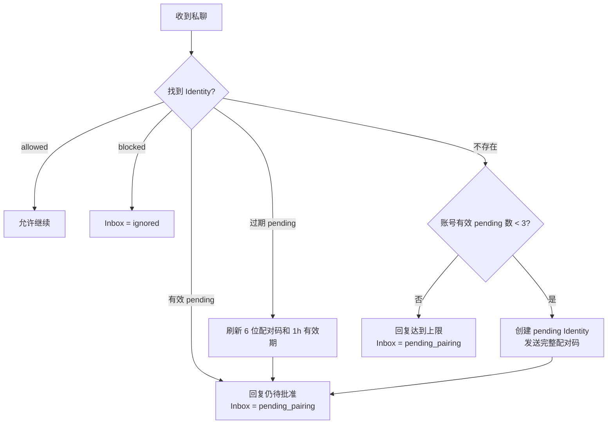
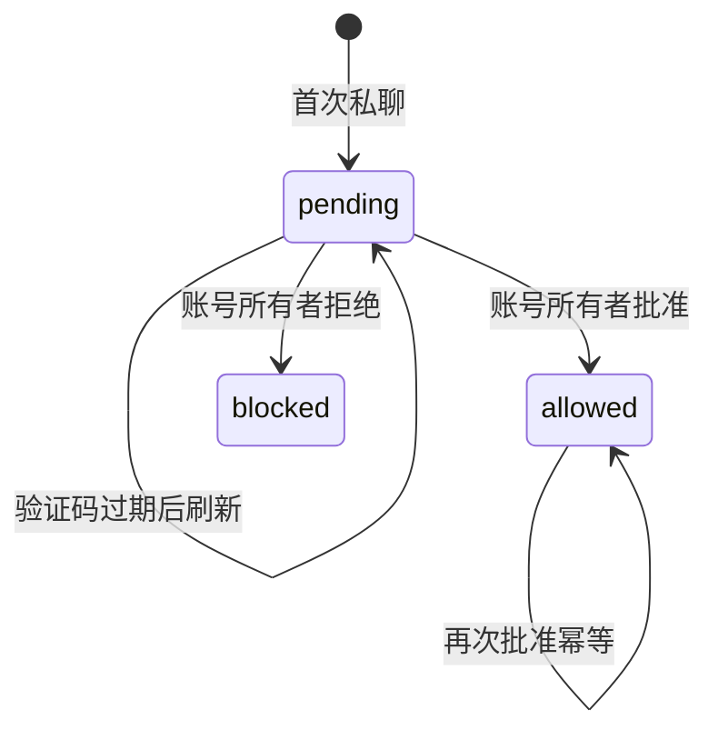
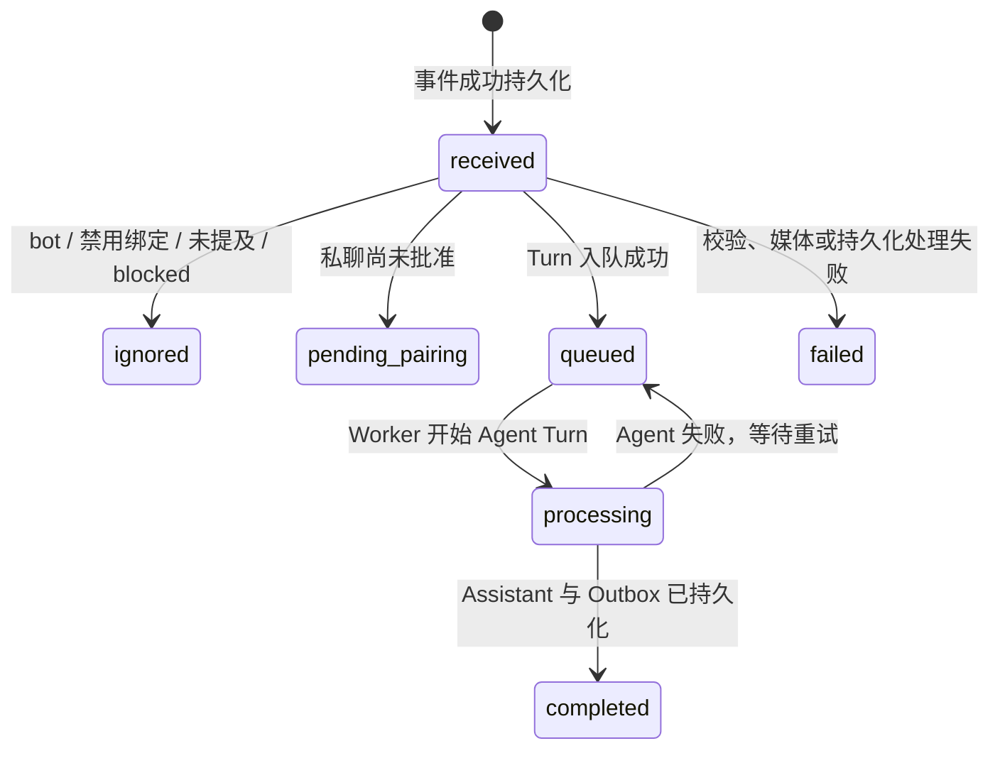
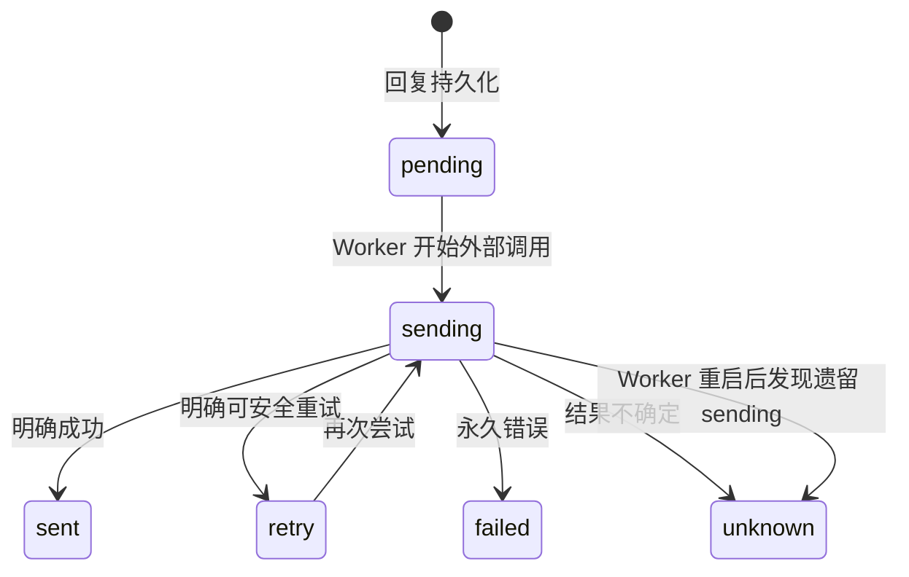

# Cove 多软件接入网关实现文档

本文描述 `packages/server` 当前消息网关的实际实现。它覆盖控制面 API、独立 Gateway 数据面、异步 Worker、PostgreSQL Inbox/Outbox、Redis 租约与队列，以及 Telegram、飞书、通用 Webhook 三类 Provider。

本文以源码行为为准，不把规划能力当作已实现能力。公开管理 API 的机器可读契约仍以 [`docs/openapi.json`](openapi.json) 为准；独立 Gateway 进程暴露的 Webhook 数据面不在该 OpenAPI 文件中，其稳定协议由本文说明。

## 1. 目标与边界

Gateway 的职责是把第三方软件中的消息转换为 Cove 对话，并把 Cove 生成的最终文本可靠地送回原渠道。

它当前解决以下问题：

- 用统一 Provider 契约适配 Telegram Bot API、飞书开放平台和任意 HMAC Webhook。
- 通过账号、外部身份、路由绑定，把外部会话隔离到对应的 Cove 用户和 Conversation。
- 在任何业务处理前持久化并去重入站事件。
- 把耗时的 Agent Turn 和最终回复投递移到 Worker。
- 通过确定性消息 ID、唯一约束、Redis 锁和持久化 Outbox 支持任务重试与进程恢复。
- 对私聊提供人工配对门控，对群聊提供显式绑定、提及门控和工具策略。
- 对外部文本和媒体采用不可信输入、防 SSRF、MIME 校验、大小限制和凭据加密等安全措施。

它不是以下组件：

- 不是 HTTP 反向代理或 API 聚合网关。
- 不负责向渠道流式转发 token、思考过程或工具事件，只发送最终 Assistant 文本。
- 不在 Gateway 进程内执行 Agent；Agent Turn 与投递都由 Worker 执行。
- 不允许客户端直接指定 Cove `user_id`；用户身份来自控制面 JWT 或账号归属快照。

## 2. 总体架构



### 2.1 三个进程的职责

| 进程 | 入口 | 网关职责 |
| --- | --- | --- |
| API | `cmd/api/main.go` | 提供 JWT 保护的账号、配对、绑定管理接口；加密凭据；发布热重载通知 |
| Gateway | `cmd/gateway/main.go` | 维护长连接/长轮询 Receiver；接收公共 Webhook；处理入站事件；周期恢复 Inbox/Outbox |
| Worker | `cmd/worker/main.go` | 消费 `gateway:turn` 和 `gateway:deliver`；执行 Agent Turn；调用 Provider 发送最终回复 |

三者都通过 `svc.New` 构造 `ServiceContext`，因此会共享同一套 PostgreSQL、Redis、Storage、Provider 注册表、LLM/RAG 等依赖配置。

### 2.2 关键依赖

| 依赖 | 用途 | 是否是网关关键依赖 |
| --- | --- | --- |
| PostgreSQL | 配置、路由、Inbox/Outbox、Conversation、Message | 是 |
| Redis | Receiver 租约、会话/投递锁、重载 PubSub、asynq 队列 | 是 |
| Worker | 执行 Agent Turn 与最终投递 | 是；仅接收入站而不启动 Worker 不会生成正常回复 |
| Object Storage | 保存入站图片和文档原文件 | 有媒体时需要 |
| LLM / RAG / MCP | 生成回复、图片理解、知识库和工具调用 | 取决于账号绑定的 Agent 配置与消息内容 |
| Elasticsearch | RAG 检索；同时由当前 `ServiceContext` 启动流程初始化 | 当前进程启动依赖 |
| Neo4j | 可选长期记忆图 | 仅在配置完整时初始化 |

## 3. 代码分层与模块地图

| 路径 | 责任 |
| --- | --- |
| `cmd/gateway/main.go` | 启动独立 HTTP 数据面和 Runtime Manager，处理信号与优雅退出 |
| `internal/core/channel/` | Provider、事件、路由、回执、能力描述等业务无关契约 |
| `internal/svc/channel_registry.go` | 在组合根注册 Telegram、飞书和 Webhook Provider |
| `internal/infrastructure/channel/telegram/` | Telegram 长轮询、规范化、发送、typing、媒体下载 |
| `internal/infrastructure/channel/feishu/` | 飞书 WebSocket、规范化、发送、媒体下载 |
| `internal/infrastructure/channel/webhook/` | HMAC 验签/签名、回调发送、受控媒体下载 |
| `internal/gateway/runtime/manager.go` | 账号对账、Receiver 租约、热重载、断线重连、Inbox/Outbox 恢复 |
| `internal/transport/gatewayhttp/router.go` | `/healthz` 和公共 Webhook 入站路由 |
| `internal/transport/http/routes/gateway.go` | JWT 管理路由注册及 OpenAPI 注解 |
| `internal/transport/http/handler/gateway.go` | 管理 API 参数绑定、用户身份读取、响应封装 |
| `internal/logic/gateway/service.go` | Provider 描述、账号、配对、绑定、凭据和热重载用例 |
| `internal/logic/gateway/ingress.go` | Inbox 去重、私聊鉴权、路由绑定、消息落库和 Turn 入队 |
| `internal/logic/gateway/media.go` | 媒体下载、MIME/大小校验、存储和内容提取 |
| `internal/worker/tasks/gateway_turn.go` | 会话串行化、共享 Chat Turn、确定性 Assistant、Outbox 创建 |
| `internal/worker/tasks/gateway_deliver.go` | Outbox 加锁、Provider 发送、回执分类和重试状态 |
| `internal/models/channel_gateway.go` | 五个持久化模型及全部状态常量 |
| `internal/repository/channel_gateway.go` | 网关仓储接口 |
| `internal/repository/postgres/channel_gateway.go` | 用户隔离查询、唯一冲突恢复、Inbox/Outbox 对账查询 |
| `internal/domain/types/task.go` | `gateway:turn`、`gateway:deliver` 任务名、队列和最小 payload |

依赖方向保持为：

```text
transport / runtime / worker
        ↓
logic/gateway + logic/chat
        ↓
core/channel + domain/flow/chat
        ↓
repository interfaces
        ↓
PostgreSQL / Redis / Provider / Storage / LLM adapters
```

## 4. 核心渠道契约

### 4.1 Provider

每个 Provider 必须实现：

- `Descriptor()`：稳定名称、管理表单字段、能力矩阵和最大文本长度。
- `Receive(...)`：持续接收入站事件。Webhook Provider 的真实入站由 HTTP Router 驱动，因此该方法只等待上下文结束。
- `Send(...)`：发送最终文本，并返回明确的 `Receipt.State`。
- `SetTyping(...)`：支持时发送输入状态；不支持的 Provider 静默降级。

可选接口：

- `Tester`：执行账号凭据/连通性检查。
- `MediaDownloader`：通过平台官方 API 或受控 HTTPS 下载入站媒体。

Provider 在 `svc.newChannelRegistry` 中静态注册。注册表会校验名称、展示名称、字段键、出站文本能力和最大文本长度，并拒绝同名覆盖；`Descriptors()` 按 Provider 名称排序，使管理 API 输出稳定。

### 4.2 统一入站事件

不同平台事件最终归一为 `core/channel.InboundEvent`：

| 字段 | 语义 |
| --- | --- |
| `provider_event_id` | Provider 范围内稳定的幂等 ID；与 `account_id` 组成唯一键 |
| `route` | `account_id + chat_type + chat_id + thread_id` |
| `sender` | 外部用户 ID、展示名、用户名、是否机器人 |
| `platform_message_id` | 用于回复原平台消息 |
| `text` | 文本或媒体 caption |
| `reply` | 被回复消息的 ID 和可选不可信文本 |
| `mentioned` | Provider 判断是否提及当前机器人 |
| `media` | 图片/文档引用，尚未被信任或下载 |
| `occurred_at` | 平台事件发生时间 |
| `received_at` | Cove 接收时间 |

统一校验要求：

- `provider_event_id`、账号 ID、聊天 ID、发送者 ID 非空。
- `chat_type` 只能为 `direct` 或 `group`。
- `text` 和 `media` 至少有一个非空。

`HandleInbound` 会覆盖事件自带的 `route.account_id` 和 `provider`，以数据库中查到的账号为准，防止调用方伪造归属。

### 4.3 路由键

路由键由以下值拼接后计算 SHA-256：

```text
account_id + NUL + chat_id + NUL + thread_id
```

同一个账号下的不同聊天或线程会得到不同 `route_key`。路由键不可直接反推出外部 ID，但绑定表仍会单独保存 `external_chat_id` 和 `external_thread_id`，用于管理和投递。

### 4.4 投递回执

Provider 必须把一次发送尝试分类为以下状态之一：

| 状态 | 含义 | Worker 行为 |
| --- | --- | --- |
| `sent` | 明确成功 | Outbox → `sent` |
| `temporary_error` | 明确未成功且可安全重试 | Outbox → `retry`，Worker 返回错误 |
| `permanent_error` | 配置、权限、参数等永久失败 | Outbox → `failed`，停止队列重试 |
| `unknown` | 请求可能已被平台接收，结果无法确定 | Outbox → `unknown`，禁止自动重发 |

底层 Go `error` 不决定是否重试，`Receipt.State` 才是唯一依据。这是防止网络超时后重复发送的核心约束。

## 5. Provider 实现差异

### 5.1 能力矩阵

下表对应当前 Provider `Descriptor()` 的声明：

| 能力 | Telegram | 飞书 | Webhook |
| --- | --- | --- | --- |
| 私聊 | 是 | 是 | 是 |
| 群聊 | 是 | 是 | 是 |
| 线程/话题 | 是 | 是 | 是 |
| 回复引用 | 是 | 是 | 是 |
| 提及识别 | 是 | 是 | 由调用方传入 `mentioned` |
| typing | 是 | 否 | 否 |
| 入站图片 | 是 | 是 | 是 |
| 入站文件 | 是 | 是 | 是 |
| 出站文本 | 是 | 是 | 是 |
| 声明的最大文本长度 | 4096 | 30000 | 16000 |

### 5.2 Telegram

配置字段：

| 类型 | 键 | 必填 | 说明 |
| --- | --- | --- | --- |
| 凭据 | `bot_token` | 是 | Telegram Bot Token，敏感字段 |
| 设置 | `bot_username` | 否 | 用于群聊中识别 `@username` |

入站行为：

- 使用 `go-telegram/bot` 长轮询，每个账号只能由持有 Redis 租约的一个 Gateway 实例运行。
- 私聊映射为 `direct`，其他聊天类型映射为 `group`。
- `MessageThreadID` 映射为 `thread_id`。
- 文本为空时使用 caption。
- 图片只取 Telegram 提供的最大尺寸版本；Document 映射为文档媒体。
- 回复消息只保留消息 ID 和文本/caption。
- 私聊默认视为已提及；群聊通过不区分大小写的 `@bot_username` 子串判断。

出站行为：

- 按 Unicode 字符以 4096 为上限切段，优先在后半段的换行处断开。
- 仅第一段附带回复引用，所有段携带同一话题 ID。
- 429 被分类为临时错误。
- Forbidden、Bad Request、Unauthorized、Not Found 被分类为永久错误。
- 第一段发生其他网络错误时结果为 `unknown`；后续段失败也为 `unknown`，因为前面的段已经发送。
- Telegram 没有使用 Cove `delivery_id` 的平台级幂等键，因此实现倾向于停止不确定重试以避免重复消息。

`POST /api/gateway/accounts/{id}/test` 会调用 Telegram `getMe`。

### 5.3 飞书

配置字段：

| 类型 | 键 | 必填 | 说明 |
| --- | --- | --- | --- |
| 凭据 | `app_id` | 是 | 自建应用 App ID |
| 凭据 | `app_secret` | 是 | App Secret，敏感字段 |
| 凭据 | `verification_token` | 否 | 事件校验 Token，敏感字段 |
| 凭据 | `encrypt_key` | 否 | 事件加密 Key，敏感字段 |
| 设置 | `bot_open_id` | 否 | 用于精确识别群聊中的机器人提及 |

入站行为：

- 使用飞书官方 SDK WebSocket 长连接，监听 `im.message.receive_v1`。
- `p2p` 映射为 `direct`，其他聊天映射为 `group`。
- 发送者 ID 按 `open_id → user_id → union_id` 的顺序选择第一个非空值。
- 文本从消息 JSON 的 `text` 字段读取。
- 图片和文件保存飞书资源键及内部 `feishu://<message_id>/<type>` 引用，真正下载时调用消息资源 API。
- `parent_id` 映射为回复引用，`thread_id` 保持为线程路由。
- 群聊提及只有在配置了 `bot_open_id` 且 mentions 中存在相同 Open ID 时才为真。

出站行为：

- 按 30000 字符切段。
- 第一段有回复引用时使用 Reply API，否则使用 Create Message API。
- `delivery_id` 作为飞书 `uuid`；后续分段使用 `<delivery_id>-<index>`，提供平台级幂等能力。
- 首段出现 `230000` 到 `239999` 的平台错误码时视为永久错误；其他首段失败当前视为临时错误。
- 后续分段失败视为 `unknown`，因为已经产生部分输出。
- 当前未实现 typing，能力矩阵明确返回 `false`。

账号测试通过获取 tenant access token 验证 `app_id` 和 `app_secret`。

### 5.4 通用 Webhook

配置字段：

| 类型 | 键 | 必填 | 说明 |
| --- | --- | --- | --- |
| 凭据 | `signing_secret` | 是 | 入站和出站共用的 HMAC 密钥 |
| 设置 | `callback_url` | 是 | Cove 投递最终回复的 HTTP(S) 地址 |
| 设置 | `media_host_allowlist` | 否 | 允许下载媒体的域名列表；为空时不能下载任何 Webhook 媒体 |

入站通过 Gateway HTTP Router 处理，不启动账号 Receiver。账号测试只校验 URL 和签名密钥格式，不向第三方发探测请求。

出站行为：

- 向 `callback_url` POST 完整 JSON，不在 Provider 内切段。
- 2xx 为成功。
- 429 和 5xx 为临时错误。
- 其他非 2xx 状态为永久错误。
- HTTP 客户端错误视为临时错误；下游必须用 `delivery_id` 去重。

注意：Descriptor 当前声明 `max_text_length=16000`，但 Webhook `Send` 尚未按该值切分或截断正文。这是当前实现限制，不应要求接收方依赖 16000 字符上限。

## 6. 持久化模型与约束

### 6.1 数据关系



### 6.2 `channel_accounts`

保存用户拥有的渠道账号：

- `provider`、展示名和随机 `public_id`。
- 按字段加密的 `encrypted_credentials`。
- 非敏感 `settings`。
- 可选默认 `agent_config_id`。
- `enabled`、健康状态、最近错误和最近心跳。
- `(id, user_id)` 组合唯一键供其他网关表建立租户复合外键。
- `public_id` 全局唯一，作为 Webhook 公共 URL 的不可预测路径部分。

删除账号会级联删除 Identity、Binding、Inbox 和 Outbox。

### 6.3 `channel_identities`

保存私聊外部身份的配对状态：

- 唯一范围：`account_id + external_user_id + external_chat_id`。
- 状态：`pending`、`allowed`、`blocked`。
- 只保存配对码 SHA-256 和末两位掩码，不保存完整验证码。
- 保存过期时间与批准时间。

### 6.4 `channel_bindings`

把外部路由绑定到 Cove Conversation 和策略：

- 唯一范围：`account_id + route_key`。
- 保存明文外部聊天/线程 ID，供投递和管理。
- 可选 `conversation_id`，首次允许处理消息时懒创建。
- 可选绑定级 `agent_config_id`。
- `require_mention`、`tool_policy`、`enabled`。
- `user_id + account_id` 通过复合外键保证账号和绑定属于同一租户。

### 6.5 `channel_inbox_events`

每个规范化入站事件一条记录：

- 唯一范围：`account_id + provider_event_id`。
- 保存规范化事件 JSON、路由键和状态。
- 保存 Conversation、用户消息、Assistant 消息、已解析 AgentConfig 的快照 ID。
- 保存工具策略、asynq task ID、入队/处理时间和安全错误摘要。
- `user_id + account_id` 使用租户复合外键。

`resolved_agent_config_id` 和 `tool_policy` 是入站时解析的执行快照，避免 Worker 从不可信队列 payload 或后来变化的绑定中重建当前回合语义。

### 6.6 `channel_outbox_messages`

每个需要可靠投递的最终回复或系统提示一条记录：

- `inbox_event_id` 唯一，确保一个 Inbox 最多产生一个 Outbox。
- `delivery_id` 全局唯一，供 Provider 或下游幂等。
- 保存租户、账号、Conversation、Assistant 消息、路由、回复引用和最终正文。
- 保存状态、尝试次数、下次尝试时间、平台消息 ID、精简回执和安全错误摘要。
- 通过 `(inbox_event_id, account_id, user_id)` 复合外键保证完整归属链。

配对提示、附件错误提示等系统回复也使用同一 Outbox 机制；这类记录不一定对应真实的 Assistant 消息。

## 7. 入站处理链路

### 7.1 协议归一化

Telegram、飞书 Receiver 或 Webhook Router 首先把平台事件转为统一 `InboundEvent`。Provider 层只处理协议细节，不决定用户权限、路由绑定或 Agent 配置。

### 7.2 先持久化、后处理

`HandleInbound` 的顺序是：

1. 用数据库账号覆盖事件中的 Provider 和账号 ID。
2. 补充 `received_at` 并校验统一事件。
3. 将事件转换为 JSON，创建 `channel_inbox_events`，初始状态为 `received`。
4. 命中 `(account_id, provider_event_id)` 唯一冲突时读取原记录并立即返回，不重复鉴权、建消息或入队。
5. 只对新建 Inbox 继续执行身份门控、绑定、媒体处理和 Turn 入队。

Webhook 重复请求会收到原 Inbox ID、当前状态和 `duplicate=true`。

### 7.3 机器人消息

如果 `sender.is_bot=true`，事件仍会先写入 Inbox，随后标记为 `ignored`，不会进入 Conversation 或触发 Agent。

### 7.4 私聊配对

私聊必须先通过账号范围的 Identity 门控：



具体语义：

- 配对码是 6 位安全随机数，有效期 1 小时。
- 哈希输入包含账号 ID，数据库只保存哈希和尾号两位。
- 每个账号最多同时存在 3 个尚未过期的 pending Identity。
- 外部用户不能通过消息直接批准自己；账号所有者必须调用 JWT 管理 API。
- 批准已过期请求会失败，需让外部用户重新发消息刷新验证码。
- 拒绝会把 Identity 置为 `blocked`；后续消息静默忽略。
- Identity 以外部用户和外部私聊 ID 共同识别，同一用户在不同聊天上下文不会自动共享配对。

配对允许后，如果尚无 Route Binding，系统会自动创建：

```text
require_mention = false
tool_policy     = inherit
enabled         = true
```

### 7.5 群聊白名单与提及门控

群聊不使用 Identity 配对，而使用 Route Binding：

- 第一次看到未知群聊/线程时，系统自动创建一个禁用绑定：`enabled=false`、`require_mention=true`、`tool_policy=safe`。
- 当前消息标记为 `ignored`，不会自动让机器人加入群聊业务流。
- 账号所有者可通过管理 API 查看并启用该绑定。
- 绑定已启用但 `require_mention=true` 时，未提及机器人的消息仍会标记为 `ignored`。

通过 API 手工创建群聊绑定时默认启用，但仍默认要求提及且使用 `safe` 工具策略。

### 7.6 Conversation 与 AgentConfig 解析

允许处理的绑定会懒创建 Conversation：

- 已有 `conversation_id` 且仍属于该 Cove 用户时直接复用。
- 私聊优先用外部发送者展示名作为标题。
- 群聊或缺少展示名时使用 `<provider> · ****<chat_id末4位>`。
- 标题最多 255 个 Unicode 字符。

AgentConfig 优先级：

```text
绑定级 agent_config_id
    > 账号 default_agent_config_id
    > 当前用户默认 AgentConfig
    > 无显式 AgentConfig
```

选中的配置必须属于账号所有者；解析结果写入 Inbox，供 Worker 使用。

### 7.7 不可信文本

外部正文最多保留 64 Ki 个 Unicode 字符，并以以下形式写入 Cove 用户消息：

```text
<external_untrusted>
Reply reference (untrusted): ...
外部正文
</external_untrusted>
```

回复引用文本最多 2000 字符。此包装向 Agent 明确标记外部内容不可信，降低把外部消息误当系统指令的风险。

### 7.8 确定性用户消息与 Turn 入队

用户消息 ID 由 Inbox ID 确定性生成：

```text
UUIDv5(URL namespace, "cove:gateway:user:" + inbox_id)
```

恢复或并发处理遇到消息唯一冲突时会读取同一条用户消息继续，不重复写入 Conversation。

随后创建只包含 `inbox_event_id` 的 `gateway:turn` 任务，并把 Inbox 更新为 `queued`。如果消息已落库但入队失败，Inbox 保持 `received`，由 Runtime Manager 周期恢复。

## 8. 媒体处理

媒体处理发生在 Gateway 入站路径中，在 `gateway:turn` 入队之前完成。

### 8.1 处理步骤

1. 确认 Provider 实现 `MediaDownloader`。
2. 检查平台声明大小不超过 `max_media_bytes`。
3. 通过官方 API或受控 HTTPS 下载，并再次检查响应大小。
4. 用 `io.LimitReader(max+1)` 读取，阻止错误或缺失 Content-Length 绕过限制。
5. 同时比较声明 MIME 和 `http.DetectContentType` 检测 MIME。
6. 把原文件写入 Cove Storage，路径归属当前用户的 `gateway` 分类。
7. 图片调用多模态模型生成描述、OCR 和场景文本；文档通过 RAG Document Parser 提取文本。
8. 把存储键、MIME、大小、提取文本或安全解析错误写入 `MessageMetaData.Attachments`。
9. Worker 只把成功提取的文本重建为本轮临时附件上下文。

### 8.2 支持类型

图片：

- JPEG
- PNG
- WebP
- GIF

文档：

- PDF
- plain text
- Markdown
- HTML / XHTML
- DOCX
- ZIP（包括 DOCX 内容探测兼容场景）

扩展名只用于存储和解析提示，是否接受主要由声明 MIME 与检测 MIME 共同决定。提取文本最多 200000 个 Unicode 字符，超出部分会截断并添加提示。

### 8.3 失败语义

- 下载、大小或安全校验失败：尝试写入一条 Outbox 错误提示，当前 Inbox 最终为 `failed`。
- 原文件已保存但图片描述/文档解析失败：保存原文件并在附件元数据记录通用解析错误。
- 消息仍有正文时，即使附件内容提取失败，正文仍可进入 Agent。
- 纯媒体消息且所有媒体都无法提取内容时：保存占位用户消息、发送补充文字提示，并把 Inbox 置为 `failed`，不执行 Agent。

### 8.4 Webhook 媒体的 SSRF 防护

Webhook 媒体必须同时满足：

- URL 使用 HTTPS。
- 主机等于 `media_host_allowlist` 中的域名，或是其子域名；使用域名边界匹配，`evil-example.com` 不会匹配 `example.com`。
- URL 主机不能是 IP 字面量。
- DNS 解析结果不能是私网、回环、链路本地、未指定或组播地址。
- 自定义 Dialer 使用已检查的解析地址，降低 DNS rebinding 风险。
- 第三次重定向会被拒绝，即最多跟随 2 次；每个目标仍必须是 HTTPS 且在白名单中。
- 不使用环境代理。

## 9. Agent Turn

`gateway:turn` 在 Worker 的 `gateway` 队列执行。Worker 队列权重为 3；任务 payload 只包含 Inbox UUID，正文、路由和凭据不会进入 Redis payload。

### 9.1 串行化与恢复

1. 读取 Inbox。
2. `ignored`、`pending_pairing`、`failed` 直接幂等退出。
3. `completed` 不再运行 Agent，只尝试重新入队已有 Outbox。
4. 对 `conversation_id` 获取 Redis 锁，TTL 2 分钟并持续续租，保证同一 Conversation 同时只有一个渠道回合。
5. Assistant 消息 ID 由 Inbox ID 确定性生成：`UUIDv5(OID namespace, inbox_id bytes)`。
6. 若该 Assistant 已存在，跳过模型调用，直接补齐 Outbox 和完成状态。
7. 否则把 Inbox 置为 `processing`，加载账号、事件、用户消息和附件提取文本。
8. 调用与 HTTP Chat 共用的 `logic/chat.RunTurn`。
9. 模型失败时丢弃部分回复，把 Inbox 恢复为 `queued`，让任务安全重试。
10. 成功后先创建 Outbox，再把 Inbox 标为 `completed`，最后入队 `gateway:deliver`。

顺序“Assistant 持久化 → Outbox 持久化 → Inbox completed → Deliver 入队”保证 `completed` Inbox 总有可恢复的最终回复。

### 9.2 typing

如果 Provider 声明支持 typing：

- Turn 开始时发送一次 typing。
- 每 4 秒刷新一次。
- Turn 结束时取消本地刷新，并尽力调用 `SetTyping(..., false)`。

typing 是尽力而为能力，失败不会中断 Agent Turn。当前只有 Telegram 声明支持；Telegram 的“停止”由平台动作自动过期实现。

### 9.3 工具策略

| 策略 | 当前行为 |
| --- | --- |
| `inherit` | 使用正常聊天工具装配：系统工具、启用的知识库工具、用户启用的 MCP 工具，并服从 ToolConfig |
| `safe` | 强制启用知识库上下文，仅装配“当前时间”和“知识库检索”；不装配 MCP |
| `none` | 返回空工具注册表，不允许工具调用 |

`safe` 是群聊默认策略；`inherit` 是私聊默认策略。ToolPolicy 不改变系统提示词、温度、Persona 等 AgentConfig 行为。

## 10. Outbox 投递

`gateway:deliver` 任务 payload 只包含 Outbox UUID。Worker 每次都从数据库重新读取账号、路由、正文和当前状态。

### 10.1 投递顺序

1. 终态 `sent`、`failed`、`unknown` 直接退出。
2. 如果任务开始时记录仍是 `sending`，说明上次进程可能在外部调用期间退出；将其改为 `unknown` 并停止自动重发。
3. 对 Outbox ID 获取 1 分钟 Redis 锁，避免多个 Worker 同时发送。
4. 按 Outbox 的 `user_id + account_id` 重新读取账号，并确认账号仍启用。
5. 解密凭据，校验持久化路由与回复引用。
6. 在外部调用前先把状态写为 `sending` 并递增 `attempt_count`。
7. 调用 Provider `Send`。
8. 仅按 `Receipt.State` 更新 `sent`、`retry`、`failed` 或 `unknown`。

### 10.2 重试与对账

临时错误会把 Outbox 置为 `retry`，并写入：

```text
next_attempt_at = now + min(5s * 2^(attempt-1), 160s)
```

Runtime Manager 每轮最多扫描 100 条：

- 所有 `pending` Outbox。
- `next_attempt_at` 为空或已经到期的 `retry` Outbox。

扫描只负责补投 `gateway:deliver` 任务。重复入队是允许的，Outbox 状态检查和 Redis 投递锁负责收敛。

当前任务没有设置自定义 asynq `MaxRetry`，并且 Handler 不主动等待 `next_attempt_at`；正在被 asynq 重试的同一个任务仍遵循 asynq 自身调度。`next_attempt_at` 主要用于 Runtime Manager 的数据库恢复扫描。Provider 返回的 `Receipt.RetryAfter` 当前也未被 Worker 使用。

### 10.3 为什么 `unknown` 不自动重试

网络超时可能发生在请求已经写出、但响应没有返回之后。盲目重试会产生重复消息。因此：

- Provider 无法证明“未发送”时必须返回 `unknown`。
- Worker 进程在 `sending` 状态退出时，下次任务也转为 `unknown`。
- `unknown` 是终态，不会被 Runtime Manager 扫描。

这选择了“可能少发一次，需要人工确认”，而不是“自动重复发送”。

## 11. 状态机

### 11.1 账号状态

| 状态 | 来源 |
| --- | --- |
| `unknown` | 新建账号默认状态 |
| `healthy` | Receiver 正常运行或账号测试成功 |
| `degraded` | 凭据解密、连接测试或 Receiver 连接失败 |
| `disabled` | 管理 API 将账号禁用 |

`last_seen_at` 在健康更新时刷新。健康更新使用 `UpdateColumns`，不会修改 `updated_at`，避免 Runtime Manager 把心跳误认为配置变化并反复重启 Receiver。

Webhook 没有持续 Receiver，因此其状态主要来自显式账号测试，而不是端到端回调健康探测。

### 11.2 Identity 状态



当前管理 API 没有把 `blocked` 重新改为 `pending` 或 `allowed` 的专用操作。

### 11.3 Inbox 状态



`RecoverInbox` 只扫描 `received`。`queued` 和 `processing` 依赖已有 asynq 任务及其重试语义；`completed` 由 Turn 任务的幂等分支恢复 Outbox 入队。

### 11.4 Outbox 状态



`sent`、`failed`、`unknown` 都是自动处理终态。

## 12. 多实例、热重载与故障恢复

### 12.1 账号对账

Runtime Manager 启动时和每个 `reconcile_interval`：

1. 查询所有 `enabled=true` 的账号。
2. 跳过 Webhook 账号，因为 Webhook 由共享 HTTP Router 接收。
3. 以账号 `updated_at.UnixNano()` 作为配置版本。
4. 停止已禁用、已删除或版本变化的本地 Receiver。
5. 为需要运行的账号启动新 goroutine。
6. 恢复最多 100 条 `received` Inbox。
7. 恢复最多 100 条可投递 Outbox。

账号创建、更新和删除后，控制面会向 Redis `gateway:reload` 发布账号 ID。每个 Gateway 实例收到后立即执行完整对账；即使 PubSub 消息丢失，周期对账也会最终生效。

绑定更新不需要重启 Receiver，因为每条入站消息都会从数据库读取当前 Binding。

### 12.2 Receiver 租约

每个非 Webhook 账号使用 Redis 键：

```text
gateway:receiver:<account_id>
```

默认 TTL 45 秒并持续续租。只有获得租约的 Gateway 实例才能启动对应 Receiver。实例退出、失联或配置重载后，其他实例可在租约失效后接管。

Receiver 中断后会在同一租约上下文内按 1、2、4、8、16、30 秒退避重连，最大 30 秒。连接中断期间账号标记为 `degraded`；每次重新进入 Receive 前标记为 `healthy`。

### 12.3 Worker 锁

| 锁 | Redis 键 | TTL | 续租 | 用途 |
| --- | --- | --- | --- | --- |
| Conversation Turn | `gateway:turn:lock:<conversation_id>` | 2 分钟 | 是 | 保持同一 Conversation 的消息与上下文顺序 |
| Outbox Delivery | `gateway:deliver:lock:<outbox_id>` | 1 分钟 | 否 | 避免同一 Outbox 并行调用 Provider |

锁获取失败返回可重试错误，让 asynq 后续再次执行。

### 12.4 恢复保证汇总

| 故障点 | 当前恢复方式 |
| --- | --- |
| Inbox 已落库，Turn 入队失败 | 保持 `received`，Runtime Manager 重新入队 |
| 用户消息已写入，Gateway 重启 | 确定性用户消息 ID，恢复时读取已有消息 |
| Agent 成功并写入 Assistant，完成流程中断 | 确定性 Assistant ID，Turn 重试跳过模型调用 |
| Outbox 已写入，Deliver 入队失败 | `completed` Turn 分支或 Outbox 周期扫描重新入队 |
| 重复外部事件 | `(account_id, provider_event_id)` 唯一约束返回原 Inbox |
| 重复 Turn 任务 | Inbox 终态、Conversation 锁和确定性消息 ID 收敛 |
| 重复 Deliver 任务 | Outbox 终态检查和 Outbox 锁收敛 |
| Provider 调用期间 Worker 退出 | 遗留 `sending` 转为 `unknown`，禁止盲目重发 |

## 13. 管理 API

所有管理路由位于 `/api/gateway`，必须携带 Cove 用户 JWT。用户 ID 从认证上下文读取，账号、Identity 和 Binding 查询都在仓储层按用户归属过滤。

正常响应使用统一 Envelope：

```json
{
  "code": 0,
  "message": "ok",
  "data": {}
}
```

### 13.1 路由总览

| 方法与路径 | 行为 |
| --- | --- |
| `GET /api/gateway/providers` | 返回编译内置 Provider、字段描述和能力矩阵 |
| `GET /api/gateway/accounts` | 按更新时间倒序列出当前用户账号 |
| `POST /api/gateway/accounts` | 创建账号、校验字段、加密凭据、发布重载 |
| `GET /api/gateway/accounts/{id}` | 获取账号详情，不返回明文凭据 |
| `PATCH /api/gateway/accounts/{id}` | 局部更新账号并发布重载 |
| `DELETE /api/gateway/accounts/{id}` | 删除账号及级联网关数据 |
| `POST /api/gateway/accounts/{id}/test` | 最多 15 秒执行 Provider 账号测试 |
| `GET /api/gateway/accounts/{id}/pairings` | 查询该账号的私聊 Identity |
| `POST /api/gateway/pairings/{id}/approve` | 批准未过期 pending Identity |
| `POST /api/gateway/pairings/{id}/deny` | 将 Identity 置为 blocked |
| `GET /api/gateway/bindings?account_id=...` | 查询绑定，可按当前用户账号筛选 |
| `POST /api/gateway/bindings` | 创建显式私聊或群聊绑定 |
| `GET /api/gateway/bindings/{id}` | 获取绑定详情 |
| `PATCH /api/gateway/bindings/{id}` | 更新 Agent、提及、工具或启用策略 |
| `DELETE /api/gateway/bindings/{id}` | 删除绑定 |

### 13.2 创建账号

Telegram 示例：

```json
{
  "provider": "telegram",
  "name": "团队机器人",
  "credentials": {
    "bot_token": "<telegram-bot-token>"
  },
  "settings": {
    "bot_username": "cove_team_bot"
  },
  "default_agent_config_id": null,
  "enabled": true
}
```

Webhook 示例：

```json
{
  "provider": "webhook",
  "name": "内部工单助手",
  "credentials": {
    "signing_secret": "<high-entropy-shared-secret>"
  },
  "settings": {
    "callback_url": "https://integration.example.com/cove/replies",
    "media_host_allowlist": ["media.example.com"]
  },
  "enabled": true
}
```

创建语义：

- Provider 只允许 `telegram`、`feishu`、`webhook`。
- 必填凭据和设置必须完整，未知键会被拒绝。
- 凭据逐字段通过 `SecretCipher` 加密后写入 JSONB。
- 未传 `enabled` 时默认 `true`。
- `default_agent_config_id` 必须属于当前用户。
- 创建成功后生成 18 字节随机值的 Base64URL `public_id`。

账号响应只返回 `credential_masked`。实现会在服务内存中解密后生成掩码，不会把明文写入响应。

### 13.3 更新账号

```json
{
  "name": "新的展示名",
  "credentials": {
    "bot_token": "<rotated-token>"
  },
  "settings": {
    "bot_username": "new_bot_name"
  },
  "enabled": true
}
```

更新语义中有两个重要差异：

- `credentials` 是按键合并更新；未传的密文字段保留。
- `settings` 是整张 map 替换；调用方必须提交希望保留的所有设置。

清空默认 AgentConfig 使用：

```json
{"clear_default_agent": true}
```

把账号设为禁用时会同步写入 `status=disabled`。重新启用后，Receiver 运行或账号测试会把状态更新为 `healthy`/`degraded`。

### 13.4 创建与更新 Binding

```json
{
  "account_id": "<account-uuid>",
  "chat_type": "group",
  "external_chat_id": "chat-42",
  "external_thread_id": "",
  "agent_config_id": null,
  "require_mention": true,
  "tool_policy": "safe",
  "enabled": true
}
```

创建默认值：

| ChatType | `require_mention` | `tool_policy` | `enabled` |
| --- | --- | --- | --- |
| `direct` | `false` | `inherit` | `true` |
| `group` | `true` | `safe` | `true` |

调用方显式传值可覆盖默认值。Binding 更新支持 `clear_agent_config=true` 清空绑定级 AgentConfig。

管理 API 创建私聊 Binding 不会绕过 Identity 配对；入站私聊仍先检查 Identity。

## 14. 通用 Webhook 数据面协议

### 14.1 入站地址

```text
POST /gateway/v1/hooks/{public_id}
```

只有 `enabled=true` 且 `provider=webhook` 的账号可以使用该地址。禁用、删除、类型不匹配或不存在都返回 404，避免暴露账号细节。

### 14.2 请求限制与签名

默认请求体上限 1 MiB。必须提供：

```text
X-Cove-Timestamp: <Unix 秒>
X-Cove-Signature: <HMAC-SHA256 hex>
```

签名输入是收到的原始 body 字节：

```text
HMAC_SHA256(signing_secret, timestamp + "." + raw_body)
```

校验使用常量时间比较。时间戳默认必须位于 Gateway 当前时间前后 5 分钟内，因此调用方与 Gateway 主机需要可靠的时钟同步。

签名必须基于实际发送的原始 JSON 字节；解析后重新序列化可能改变空格或键顺序，从而导致签名失败。

### 14.3 入站 JSON

```json
{
  "event_id": "stable-event-id",
  "chat_type": "direct",
  "chat_id": "chat-42",
  "thread_id": "",
  "message_id": "message-9",
  "sender": {
    "id": "user-7",
    "display_name": "Cove User",
    "username": "cove_user",
    "is_bot": false
  },
  "text": "请总结附件",
  "reply": {
    "message_id": "message-8",
    "text": "上一条消息"
  },
  "mentioned": false,
  "media": [
    {
      "id": "document-1",
      "kind": "document",
      "mime_type": "application/pdf",
      "file_name": "report.pdf",
      "size": 102400,
      "url": "https://media.example.com/report.pdf"
    }
  ],
  "occurred_at": "2026-07-18T12:00:00Z"
}
```

字段规则：

- `event_id`：必填；数据库字段容量为 255，调用方必须在同一账号内稳定且唯一。
- `chat_type`：`direct` 或 `group`。
- `chat_id`：必填；数据库相关字段容量为 255。
- `thread_id`、`message_id`：可选；持久化相关字段容量为 255。
- `sender.id`：必填；Identity 字段容量为 255。
- `text` 与 `media`：至少一个非空。
- `mentioned`：群聊调用方必须正确计算；Gateway 不会为通用 Webhook 重新解析正文提及。
- `occurred_at`：可选；缺省为 Gateway 当前时间。
- 媒体 `kind` 当前只接受后续处理可识别的 `image` 或 `document`。

### 14.4 入站响应

成功持久化后返回 HTTP 202：

```json
{
  "event_id": "<cove-inbox-uuid>",
  "duplicate": false,
  "status": "queued"
}
```

重复请求仍返回 202，但 `duplicate=true`，`event_id` 和 `status` 来自原 Inbox。

公共数据面不使用控制面 Envelope。错误格式为：

```json
{"error": "invalid webhook signature"}
```

| HTTP 状态 | 场景 |
| --- | --- |
| 400 | JSON 或必要字段无效 |
| 401 | 时间戳或 HMAC 签名无效 |
| 404 | 账号不存在、禁用或不是 Webhook Provider |
| 413 | 请求体超过限制 |
| 422 | 已验签事件在统一入站处理阶段被拒绝 |
| 503 | 请求上下文已取消，Gateway 不可用 |

如果事件已经写入 Inbox、但后续 Turn 入队失败，请求可能返回 422；该 Inbox 会保持 `received` 并由周期对账恢复。调用方可以用同一 `event_id` 重试，重复请求不会创建第二条用户消息。

### 14.5 最终回复回调

Gateway 向 `callback_url` 发送：

```text
POST <callback_url>
Content-Type: application/json
X-Cove-Timestamp: <Unix 秒>
X-Cove-Signature: <HMAC-SHA256 hex>
X-Cove-Delivery-ID: <delivery_id>
```

Body：

```json
{
  "delivery_id": "stable-delivery-id",
  "route": {
    "account_id": "<cove-account-uuid>",
    "chat_type": "direct",
    "chat_id": "chat-42",
    "thread_id": ""
  },
  "text": "最终回复",
  "reply_to": {
    "message_id": "message-9"
  }
}
```

接收方要求：

- 使用 `delivery_id` 或 `X-Cove-Delivery-ID` 做幂等去重。
- 对完整原始 body 使用同一 `signing_secret` 验签。
- 成功处理后返回任意 2xx。
- 需要重试时返回 429 或 5xx。
- 不可重试的请求返回其他 4xx。

## 15. 安全设计

### 15.1 租户隔离

- 控制面只从 JWT 上下文读取用户 ID。
- 账号和 Binding 直接按 `user_id` 查询。
- Identity 通过关联账号验证用户归属。
- AgentConfig 和 Conversation 在使用前按用户重新查询。
- Binding、Inbox、Outbox 使用复合外键，阻止跨租户拼接账号和事件。
- Worker 队列只携带内部 UUID，并从数据库归属链重新加载资源。

### 15.2 凭据保护

- Provider 凭据在写库前逐字段使用 `SECRET_KEY` 对应的 `SecretCipher` 加密。
- API 只返回掩码，不返回密文或明文。
- 账号测试、Receiver 和投递仅在需要时解密为内存快照。
- 日志不记录 Token、密钥、消息正文、媒体 URL 或完整外部聊天 ID。

`SECRET_KEY` 必须稳定保存。更换密钥但不迁移已有密文会导致账号凭据解密失败。

### 15.3 外部输入隔离

- 外部正文用 `<external_untrusted>` 包装。
- bot 消息不会进入 Agent。
- 私聊默认人工配对，群聊默认禁用绑定并要求提及。
- 媒体同时进行平台下载、大小、声明 MIME 和检测 MIME 校验。
- Webhook 媒体实施域名白名单、DNS/IP、Dialer 和重定向多层 SSRF 防护。

### 15.4 Webhook 防重放

- `public_id` 是不可预测随机路径，不承担认证本身。
- HMAC 校验请求完整性和共享密钥持有权。
- 时间窗口限制旧请求重放。
- Inbox 唯一键保证时间窗口内重复事件不重复处理。

当前公共 Webhook 路由没有独立的速率限制器；部署层应按来源、路径和请求体大小补充限流与连接保护。

## 16. 配置

### 16.1 YAML 与默认值

```yaml
gateway:
  enabled: false
  host: 0.0.0.0
  port: 8010
  reconcile_interval: 30s
  lease_ttl: 45s
  webhook_signing_window: 5m
  callback_timeout: 10s
  max_request_bytes: 1048576
  max_media_bytes: 20971520
```

| YAML | 环境变量 | 默认值 | 用途 |
| --- | --- | --- | --- |
| `enabled` | `GATEWAY_ENABLED` | `false` | 是否启动 Gateway 数据面；false 时进程打印日志后正常退出 |
| `host` | `GATEWAY_HOST` | `0.0.0.0` | HTTP 监听地址 |
| `port` | `GATEWAY_PORT` | `8010` | HTTP 监听端口 |
| `reconcile_interval` | `GATEWAY_RECONCILE_INTERVAL` | `30s` | 账号和 Inbox/Outbox 周期对账间隔 |
| `lease_ttl` | `GATEWAY_LEASE_TTL` | `45s` | 非 Webhook Receiver Redis 租约 TTL |
| `webhook_signing_window` | `GATEWAY_WEBHOOK_SIGNING_WINDOW` | `5m` | 入站 Webhook 时间戳容差 |
| `callback_timeout` | `GATEWAY_CALLBACK_TIMEOUT` | `10s` | 通用 Webhook 最终回复回调超时 |
| `max_request_bytes` | `GATEWAY_MAX_REQUEST_BYTES` | `1048576` | 公共 Webhook 请求体上限 |
| `max_media_bytes` | `GATEWAY_MAX_MEDIA_BYTES` | `20971520` | 单个入站媒体上限 |

非法或非正数的时长值在使用点回退到对应默认值。字节限制小于等于 0 时也会在运行点回退到默认限制。

### 16.2 其他必须一致的配置

Gateway、API 和 Worker 至少应共享：

- `DATABASE_URL`
- `REDIS_*`
- `SECRET_KEY`
- `STORAGE_*` / `COS_*`
- LLM、模型配置和 RAG 依赖

如果使用本地文件 Storage，多进程或多主机部署必须确保看到同一持久化目录；生产 Compose 通过共享 `storage_data` 挂载实现这一点。

## 17. 启用与部署

### 17.1 安全启用顺序

1. 部署包含五个网关模型的代码并运行数据库迁移。
2. 启动 API、Redis 和 Worker。
3. 通过 JWT 管理 API 创建账号，执行账号测试。
4. 完成私聊配对和群聊 Binding 配置。
5. 设置 `gateway.enabled=true` 或 `GATEWAY_ENABLED=true`。
6. 启动 Gateway，并检查 `/healthz`、账号状态和 Worker 日志。

先迁移和配置、后启动 Receiver，可避免新部署立即接管生产 Bot 连接。

### 17.2 本地开发

分别启动：

```bash
make migration
make api
make worker
GATEWAY_ENABLED=true make gateway
```

Gateway 默认监听 `0.0.0.0:8010`：

```text
GET http://localhost:8010/healthz
```

响应：

```json
{"status":"ok"}
```

该端点目前只表示 HTTP 进程存活，不检查 PostgreSQL、Redis、Worker、Provider Receiver 或回调端到端可用性。

### 17.3 Docker Compose

Gateway 使用显式 profile，默认 `docker compose up` 不会自动启动：

```bash
docker compose -f deployments/docker-compose.yml --profile gateway up -d gateway
```

镜像通过同一 Dockerfile 的 `CMD_TARGET=gateway` 构建。容器健康检查访问 `http://localhost:8010/healthz`。

生产 Compose 同样使用 `profiles: ["gateway"]`，并挂载共享配置文件与 Storage volume。多实例部署时不需要人工给账号分片，Redis Receiver 租约会选择单个持有者。

## 18. 可观测性与排障

### 18.1 结构化日志组件

| 组件 | 典型事件 |
| --- | --- |
| `logic.gateway` | Inbox 去重、持久化、处理完成、Turn/Outbox 入队 |
| `gateway.runtime` | Receiver 中断、Inbox/Outbox 对账 |
| `worker.gateway.turn` | 会话锁、Agent 开始/完成/恢复、Outbox 创建 |
| `worker.gateway.deliver` | 投递锁、尝试次数、Provider 状态、重试/终态 |

日志使用稳定字段，例如：

- `inbox_id`
- `outbox_id`
- `account_id`
- `conversation_id`
- `provider`
- `inbox_status` / `outbox_status`
- `attempt`
- `delivery_state`
- `duration_ms` / `send_duration_ms`
- `error_kind`

日志刻意不记录外部正文、Token、媒体 URL 或完整平台错误体。

### 18.2 账号健康字段

管理 API 的账号响应包含：

- `status`
- `last_error`
- `last_seen_at`
- `updated_at`

`last_error` 是安全概括，例如“连接测试失败”“渠道连接中断，正在重连”，不是第三方原始错误。

### 18.3 常见问题

#### Gateway 启动后立即退出

检查 `gateway.enabled` 或 `GATEWAY_ENABLED`。默认值是 `false`，关闭时进程正常返回而不是报错。

#### Webhook 返回 404

检查：

- URL 使用的是账号响应中的 `public_id`，不是账号 UUID。
- 账号 `provider=webhook`。
- 账号仍存在且 `enabled=true`。

#### Webhook 返回 401

检查：

- 时间戳是 Unix 秒，不是毫秒。
- 调用方和 Gateway 系统时钟偏差不超过签名窗口。
- 签名基于实际发送的原始 body。
- 使用账号当前 `signing_secret`。

#### 返回 202 但没有回复

按顺序检查：

1. Inbox 状态是否为 `pending_pairing`、`ignored`、`failed`、`queued`、`processing` 或 `completed`。
2. Worker 是否消费 `gateway` 队列。
3. 是否能获取 Conversation 锁，Agent/LLM 是否可用。
4. 是否已经创建 Outbox。
5. Outbox 是否为 `retry`、`failed` 或 `unknown`。
6. 账号是否仍启用，Provider 凭据是否可解密。

#### 私聊一直提示配对

检查 Identity 是否仍为 `pending`、是否过期，以及批准接口使用的是 Identity UUID 而不是显示的配对码。控制面只显示验证码尾号用于人工核对。

#### 群聊消息被忽略

检查：

- 对应 account/chat/thread Binding 是否存在且启用。
- `require_mention` 是否为 true。
- Telegram 是否配置正确的 `bot_username`。
- 飞书是否配置正确的 `bot_open_id`。
- 通用 Webhook 是否传入正确的 `mentioned=true`。

#### Webhook 媒体下载失败

检查：

- URL 是否为 HTTPS。
- 域名是否在 `media_host_allowlist`，且没有重定向到其他域名。
- DNS 是否解析到公网地址。
- MIME、实际文件类型和 `kind` 是否一致。
- 单文件是否超过 `max_media_bytes`。

#### Outbox 为 `unknown`

这表示 Cove 无法证明上次请求没有被平台接收。当前不会自动重发，也没有管理 API 将其重置为 `retry`。应先到外部平台或回调接收方按 `delivery_id` 核对，再决定是否进行人工补偿。

### 18.4 只读数据库诊断

排障时优先查询状态和 ID，避免读取敏感凭据、规范化正文和 Outbox 正文：

```sql
SELECT id, provider, enabled, status, last_error, last_seen_at, updated_at
FROM channel_accounts
WHERE user_id = '<user-uuid>'
ORDER BY updated_at DESC;

SELECT id, account_id, status, conversation_id, task_id, error_message, created_at, updated_at
FROM channel_inbox_events
WHERE account_id = '<account-uuid>'
ORDER BY created_at DESC
LIMIT 50;

SELECT id, inbox_event_id, status, attempt_count, next_attempt_at,
       platform_message_id, last_error, created_at, updated_at
FROM channel_outbox_messages
WHERE account_id = '<account-uuid>'
ORDER BY created_at DESC
LIMIT 50;
```

## 19. 测试与验证

当前实现的重点测试覆盖：

- Provider 注册表校验、排序和重复注册。
- 路由键稳定性与 Unicode 文本切分。
- Telegram 提及识别和不确定投递分类。
- 飞书辅助解析与发送错误映射。
- Webhook HMAC、时间窗口、域名边界和回调签名。
- 凭据字段/设置校验、账号掩码、能力映射和配对过期。
- 不可信文本包装、配对码、确定性用户消息、可恢复入队错误和 AgentConfig 优先级。
- 媒体 MIME 不一致和提取文本截断。
- Gateway 时长回退、路由注册、任务 codec。
- Turn/Deliver 幂等、终态、锁、投递分类和状态更新。
- 模型迁移注册与租户复合外键。

网关相关的快速验证命令：

```bash
go test -count=1 \
  ./internal/core/channel \
  ./internal/infrastructure/channel/... \
  ./internal/logic/gateway \
  ./internal/gateway/runtime \
  ./internal/transport/gatewayhttp \
  ./internal/transport/http/routes \
  ./internal/worker/tasks \
  ./internal/models \
  ./internal/svc
```

管理 API 契约或 DTO 变化后还应运行：

```bash
make docs
go run ./cmd/codegen doctor --format json
```

外部 Provider 的真实凭据、长连接、回调接收方、PostgreSQL、Redis、Storage 和 LLM 仍需要集成环境验证；单元测试不会访问真实第三方账号。

## 20. 扩展新 Provider

新增 Provider 时至少需要：

1. 在 `core/channel` 增加稳定 `ProviderName`。
2. 在 `internal/infrastructure/channel/<provider>/` 实现 `Provider`，必要时实现 `Tester` 和 `MediaDownloader`。
3. 提供完整且可校验的 Descriptor；字段键不能与设置键重复。
4. 把平台事件规范化为稳定 `ProviderEventID`、Route、Sender、Mention 和 Media。
5. 明确每类发送错误是 `temporary`、`permanent` 还是 `unknown`，尤其处理分段发送的部分成功。
6. 在 `internal/svc/channel_registry.go` 注册 Provider。
7. 更新账号请求 DTO 的 `provider` 枚举、OpenAPI、管理端消费者和本文能力矩阵。
8. 增加凭据测试、入站规范化、出站分段、错误分类、媒体下载和安全测试。

不得把 Provider 特有鉴权、配对或租户逻辑放入适配器；这些策略应继续由 `logic/gateway` 统一执行。

## 21. 当前限制与演进注意事项

以下是当前代码边界，不是未来承诺：

- 只发送最终文本，不发送出站图片、文件、流式 token、思考或工具进度。
- Webhook 声明的 16000 字符上限尚未在 `Send` 中执行。
- 公共 Webhook 只有 liveness 健康检查，没有依赖、Receiver、队列或端到端 readiness。
- 没有公开 Inbox/Outbox 查询、人工重放或 `unknown` 补偿 API；当前需通过数据库和外部平台排障。
- 公共 Webhook 路由没有应用内速率限制，需要部署层保护。
- 媒体下载、存储和内容提取在入站请求/Receiver 回调中同步执行；大文件和图片描述会增加入站延迟。
- 多附件按顺序处理，下载或安全校验错误会中止后续附件；此前已经写入 Storage 的文件当前没有自动补偿删除。
- `RecoverInbox` 只扫描 `received`，`queued/processing` 依赖 asynq 任务恢复；`unknown` 出站永不自动重发。
- Outbox 的 `next_attempt_at` 只参与周期恢复扫描，未取代 asynq 自身的重试调度，也未使用 Provider 的 `RetryAfter`。
- Provider 是编译期静态注册，不支持运行时插件加载。
- 账号 `status` 是 Receiver/显式测试健康概括，不代表完整的“入站 → Agent → 出站”端到端 SLA。
- `WebhookInboundRequest` 虽声明了 `max=255` binding tag，但当前公共 Handler 使用原生 `json.Decoder` 和手工必填校验，没有运行 Gin validator；超长 ID 可能到数据库阶段才失败，而不是稳定返回 400。

修改可靠性语义时必须一起审计模型状态、仓储扫描条件、asynq 行为、Provider 回执分类、唯一约束和测试；只改其中一层容易造成重复消息或不可恢复的中间状态。
